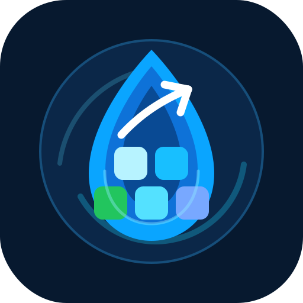

<p align="center">
  
</p>

# Drupal Team Launchpad

<p align="center">
  <a href="#quick-start"></a>
  
  
  
  
</p>

A starter repo for Drupal builds that need team structure before they need custom code.

It gives you the boring parts up front: DDEV, Composer, pnpm, formatting, Drupal coding standards, role briefs, planning docs, a decisions log, handoff notes, and launch prompts for AI coding agents.

Use it when you want a Drupal project to start clean instead of spending week one arguing about docroots, tooling, ownership, and who is allowed to invent requirements.

## What this is

Drupal Team Launchpad is not a Drupal distribution. It does not ship a theme, install profile, content model, or pile of custom modules.

It is the repo you start from before those decisions are safe to make.

The goal is simple: get a real Drupal team, human or agentic, working from the same assumptions.

## What you get

- A Drupal-ready local baseline using DDEV, Composer, fnm, pnpm, Prettier, PHP_CodeSniffer, and Drupal Coder.
- A default project shape with `web/` as the Drupal docroot.
- Role briefs for a team lead, module developer, themer, writer, and designer.
- Plain Markdown planning docs for the brief, backlog, decisions, handoffs, workflow, theme tooling, Drupal operations, and agent launch prompts.
- A bias toward Drupal configuration and contributed modules before custom code.
- A quality bar that asks every contributor to say what changed, how it was checked, what is still assumed, and who needs the handoff.

## Who this is for

This fits teams that are starting a Drupal site and want sane defaults without pretending discovery is done.

It is especially useful when:

- the Drupal app has not been scaffolded yet
- the content model is still unknown
- design and editorial decisions need to happen before architecture hardens
- multiple contributors or coding agents will touch the repo
- you want project decisions recorded in Git instead of lost in chat

If you already have a mature Drupal codebase, this repo is probably more useful as a checklist than as a base.

## Quick start

### 1. Create your project repo

```bash
git clone git@github.com:YOUR-ORG/drupal-team-launchpad.git my-drupal-site
cd my-drupal-site
```

Or create a new repository from this one as a GitHub template.

### 2. Install the repo tooling

```bash
fnm use
corepack enable
pnpm install --frozen-lockfile
composer install
```

The repo includes `.fnmrc`, `.node-version`, and `.nvmrc` so common Node workflows agree. `fnm` is the preferred version manager. pnpm is the package manager. Do not add npm or yarn lockfiles.

### 3. Start DDEV

```bash
ddev start
```

DDEV is configured for:

- Drupal 11 default target
- `web/` docroot
- PHP 8.3
- MySQL 8.0
- nginx-fpm
- Composer 2
- Node 22 inside DDEV

### 4. Fill in the project brief

Start here before writing application code:

```text
project/site-brief.md
project/decisions.md
project/backlog.md
```

The first useful task is deciding what the site is for, who owns it, who uses it, what must launch, and what constraints are real.

### 5. Scaffold Drupal when the baseline is ready

This repository starts as a team and tooling scaffold. When you are ready to create the Drupal app, use a Composer-managed Drupal project with `web/` as docroot.

A typical next step is:

```bash
ddev composer create-project drupal/recommended-project .
```

Do not run that blindly in a repo with existing docs and tooling. Review the generated files first and decide how to merge Composer's scaffold with this starter.

## Repository map

```text
.
├── AGENTS.md                         # top-level team/agent operating guide
├── agents/                           # role briefs
│   ├── team-lead.md
│   ├── drupal-module-developer.md
│   ├── drupal-themer.md
│   ├── writer-content-strategist.md
│   └── designer-ux-lead.md
├── project/                          # planning and coordination docs
│   ├── site-brief.md
│   ├── technical-standards.md
│   ├── workflow.md
│   ├── backlog.md
│   ├── decisions.md
│   ├── handoffs.md
│   ├── drupal-operations.md
│   ├── theme-tooling.md
│   └── launching-agents.md
├── .ddev/                            # DDEV local dev config
├── docs/assets/                      # README/logo assets
├── composer.json                     # PHP_CodeSniffer + Drupal Coder tooling
├── phpcs.xml.dist                    # Drupal/DrupalPractice ruleset
├── package.json                      # pnpm + Prettier baseline
└── pnpm-lock.yaml
```

Expected Drupal app layout after Composer scaffold:

```text
composer.json
config/sync/
web/modules/custom/
web/themes/custom/
web/sites/default/
```

## Team model

The repo assumes a small Drupal delivery team:

| Role                        | Owns                                                                                     |
| --------------------------- | ---------------------------------------------------------------------------------------- |
| Team Lead / Integrator      | scope, decisions, handoffs, review, integration                                          |
| Drupal Module Developer     | custom modules, plugins, services, hooks, schema, APIs, tests                            |
| Drupal Themer               | Twig, libraries, preprocess, CSS, JavaScript, frontend accessibility                     |
| Writer / Content Strategist | sitemap, content model guidance, page copy, labels, metadata, editorial workflow         |
| Designer / UX Lead          | IA, visual direction, design tokens, components, responsive behavior, interaction states |

Each role has a brief in `agents/`. The point is not bureaucracy. The point is to stop backend, theme, content, and design work from making hidden assumptions about each other.

## Working with AI coding agents

This scaffold works well with Hermes, Claude Code, Codex, OpenCode, or any coding agent that can read files and edit a repo.

Use role-scoped prompts. Example:

```text
You are the Drupal Themer for this repository. Read AGENTS.md, project/site-brief.md, project/workflow.md, project/technical-standards.md, project/decisions.md, project/backlog.md, and agents/drupal-themer.md. Take T005 from project/backlog.md. Keep changes small, document assumptions, and update project/handoffs.md if another role depends on your output.
```

More prompts are in `project/launching-agents.md`.

Routine Drupal operations are documented in `project/drupal-operations.md`, including DDEV vs host execution, Drush usage, Composer updates, database updates, config import/export, cache rebuilds, module enable/uninstall commands, security audit checks, coding standards, and provider-neutral guidance for Hermes, Codex, and Claude.

Rules for agents are intentionally strict:

- read the shared docs before changing files
- keep work small and reviewable
- record open questions instead of guessing
- use Drupal configuration before custom code
- document verification, even when the only honest verification is manual review

## Quality bar

A task is not done until the contributor or agent documents:

- what changed
- how it was verified
- what assumptions remain
- whether another role needs a handoff

Current checks:

```bash
composer validate
composer audit
composer lint:php
pnpm format:check
pnpm lint
```

Formatting commands:

```bash
composer format:php
pnpm format
```

Preferred checks once the Drupal app exists:

```bash
ddev composer validate
ddev composer audit
ddev drush updatedb -y
ddev drush config:status
ddev drush cache:rebuild
ddev exec vendor/bin/phpcs
ddev exec vendor/bin/phpunit
```

Run PHP, Drupal, database, and web-container checks through DDEV. Run fnm and pnpm commands on the host unless the project decides otherwise.

## What this is not

This is not:

- a Drupal distribution
- a theme framework
- a replacement for discovery
- a starter kit for speculative custom modules
- permission for agents to invent final requirements

It is a clean launchpad for Drupal teams that want speed without chaos.

## Recommended first issues

If you are turning this into a real site, create issues for:

1. Fill in site brief and launch constraints
2. Confirm Drupal version and hosting target
3. Scaffold Composer Drupal app
4. Define content model and sitemap
5. Define visual direction and component inventory
6. Scaffold custom theme
7. Decide accessibility testing approach
8. Decide deployment and config workflow

## License

MIT. See `LICENSE`.
